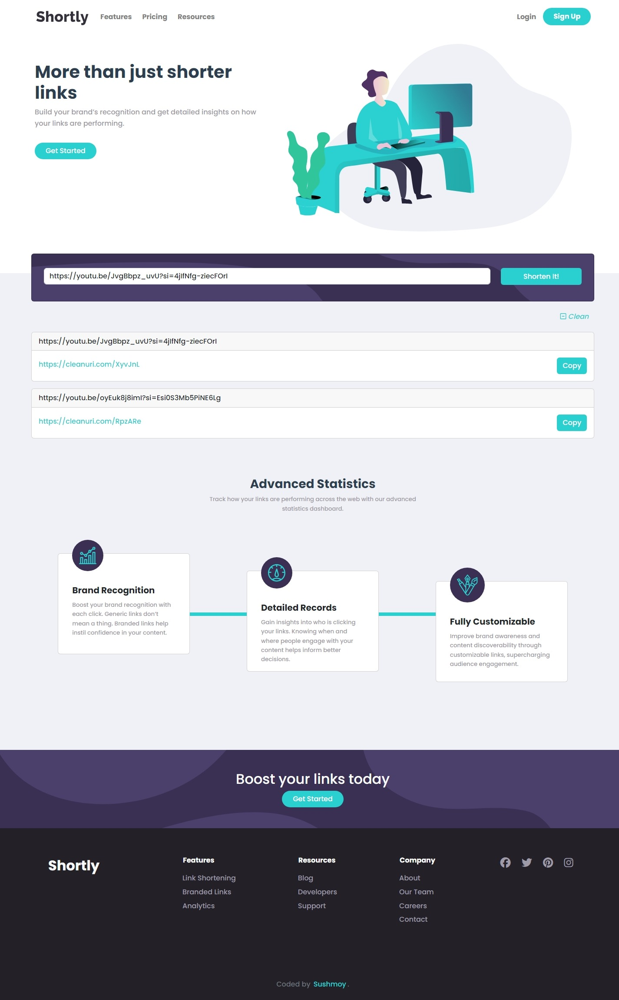

# Shortly

Welcome to the Shortly!
This web application allows users to easily shorten long URLs and conveniently copy the shortened URL. Additionally, the app provides the functionality to directly open the shortened URL for testing purposes.

Live Site: [Shortly](https://your-live-site-url.com)

## Table of contents

- [Features](#features)
- [Screenshot](#screenshot)
- [Technologies Used](#technologies-used)
- [Lessons Learned](#lessons-learned)
- [Acknowledgments](#acknowledgments)

### Features

- Easily shorten any valid URL.
- Access a list of your shortened links, which persists even after refreshing the browser.
- Copy the shortened link to your clipboard with a single click.
- Click on shortened links to open them directly in a new page.
- Clear button to remove all shortened URLs from the list.
- Enjoy an optimal layout tailored to your device's screen size for a seamless user experience.

### Screenshot

### Technologies Used

- Vuejs
- CSS
- Bootstrap

### Lessons Learned

1. Starting with a mobile-first approach proved to be more effective for me.
2. Employing `navigator.clipboard.writeText(index)` enables copying text to the clipboard using JavaScript.
3. Utilizing the `:not()` pseudo-class in CSS allows styling all elements except those specified inside the `:not()` selector.
4. To use `mx-auto` properly, apply it to a block-level element with a defined width.
5. When confused, adding an outer div container can help organize layout.
6. `JSON.parse()` converts strings into JavaScript objects, often used for API responses.
7. In Vue.js, `computed` properties reactively update based on changes, while `watch` is used for side effects.

### Acknowledgments

This project is a solution to the challenges provided by [Frontend Mentor](https://www.frontendmentor.io/solutions/efficient-age-calculation-with-javascript-and-vuejs-validation-L9dCXc8B0f), with additional features implemented by me.
